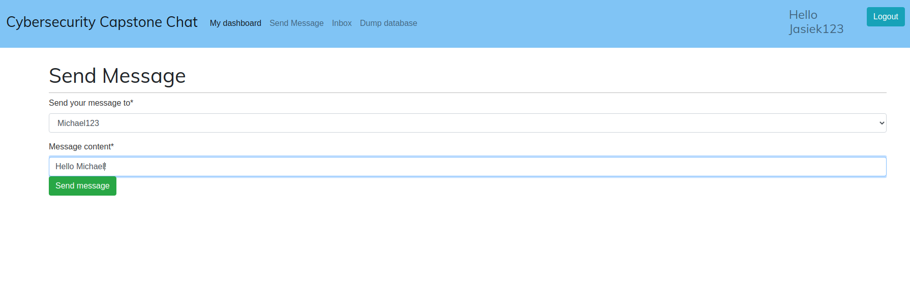
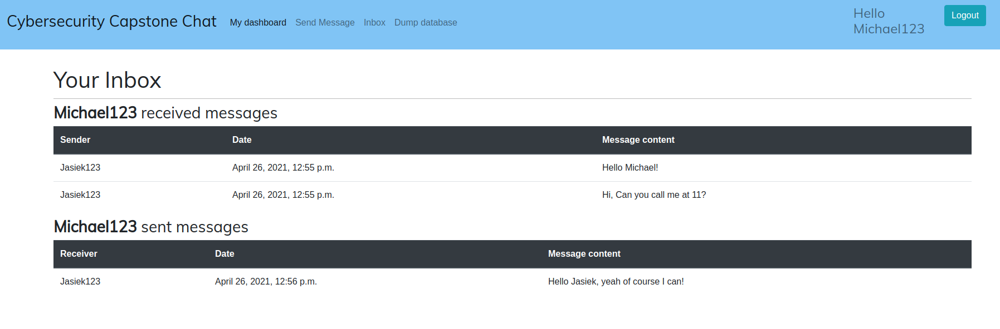
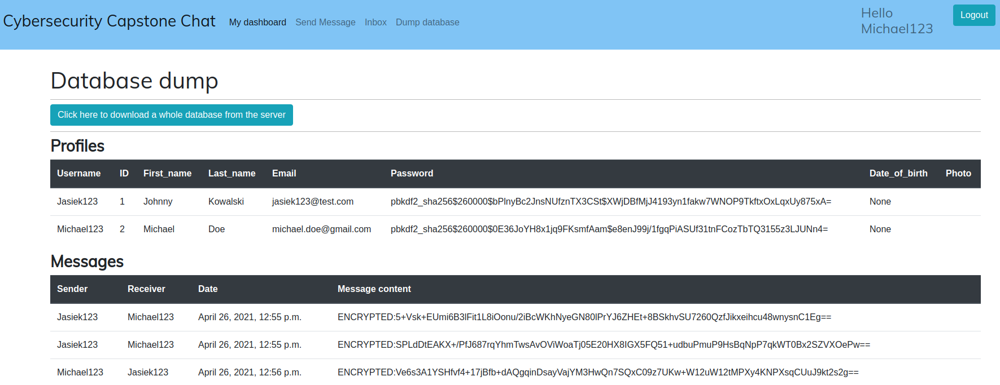
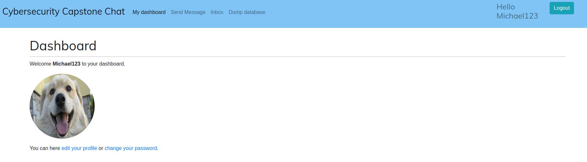

# coursera-cybersecurity-capstone
Solution for [Coursera Cybersecurity Capstone Project](https://www.coursera.org/learn/cyber-security-capstone)

## Some pics of the working app
* Send message view:

* Inbox:

* Database dump:

* Dashboard:


## Create a project structure (Not need to run it)
```
django-admin startproject chat_project
cd chat_project
django-admin startapp account
```

## Build and run the app

### Using make command
The easiest way to setup, build and run a full clean environment is by calling `make`:

For Development server:
```
make setup
make run
```
Go to: `http://127.0.0.1:8000/`

For Production server:
```
make setup prod=on
make run prod=on
```
Go to: `http://<your_server_ip>:80/`

### All the steps used in Makefile described below
#### Setup
```
python3 -m venv venv
source venv/bin/activate
pip install -U pip
pip install -r requirements.txt
```

#### Build
```
source venv/bin/activate
cd chat_project
python manage.py makemigrations && python manage.py migrate
```

#### Create an admin account (only if needed)
```
python manage.py createsuperuser --username=luk6xff --email=luk6xff@example.com
$ password: ...
```

#### Run a development server
Modify `DEBUG` flag from: `chat_project/chat_project/settings.py`
```
DEBUG = True
```
Run the server
```
python manage.py runserver 127.0.0.1:8000
```
Go to a website: `http://127.0.0.1:8000/`

#### Run a production server
Modify `DEBUG` flag from: `chat_project/chat_project/settings.py`
```
DEBUG = False
```

Test if gunicorn works
```
gunicorn chat_project.wsgi:application --bind 0.0.0.0:80
```
Go to a website `http://0.0.0.0:80/` and see if it is accessible.

First you need to install `nginx` server
```
sudo apt-get update
sudo apt install nginx
sudo rm -rf /etc/nginx/sites-available/default
sudo rm -rf /etc/nginx/sites-enabled/default
touch /etc/nginx/sites-available/chat_project && cp chat_project/chat_project_nginx.conf /etc/nginx/sites-available/chat_project
mkdir -p chat_project/logs && touch chat_project/logs/nginx-access.log

sudo ln -sf /etc/nginx/sites-available/chat_project /etc/nginx/sites-enabled
```

Modify `/etc/nginx/nginx.conf` as shown below:
```
user root www-data
```

Check if created configuratin does not contain any bugs by typing:
```
sudo nginx -t
```

Collect all the static files
```
python manage.py collectstatic
```

Modify a gunicorn run command to be able to talk to Nginx:
```
pkill gunicorn
chmod a+x run_gunicorn.sh && ./run_gunicorn.sh

or:

gunicorn --daemon --workers=3 --bind unix:/tmp/chat_project.sock chat_project.wsgi
```

Restart Nginx:
```
systemctl restart nginx
```

Go to: `http://<your_server_ip>:80/`